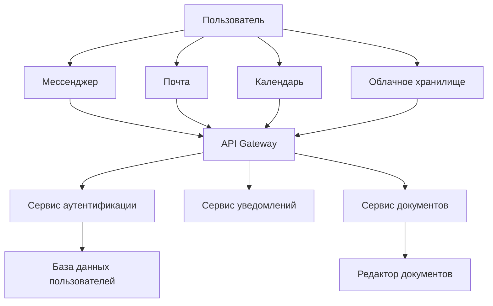
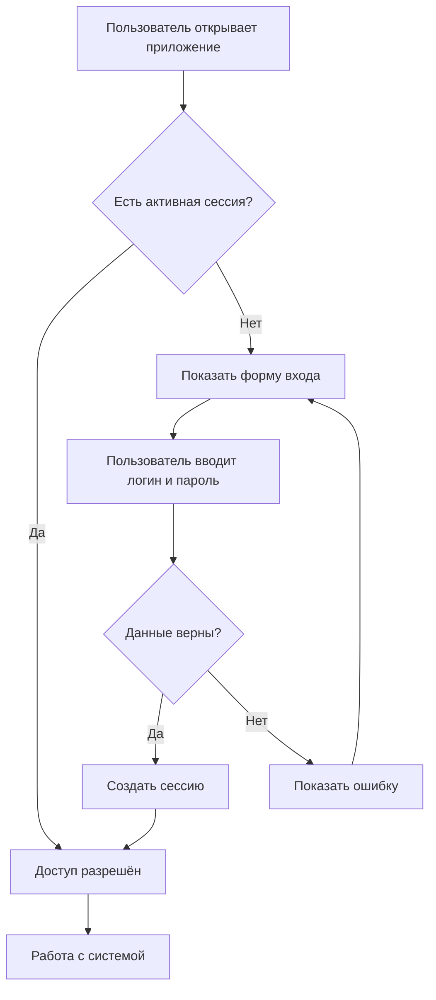
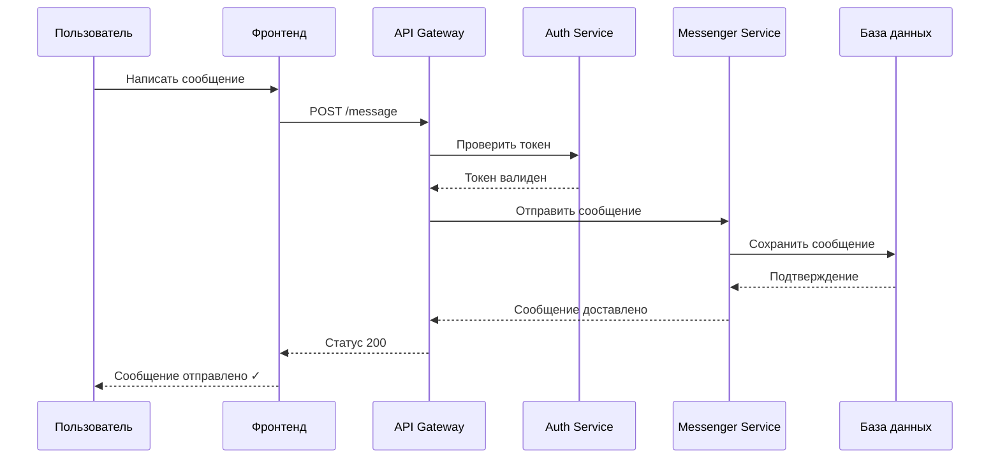
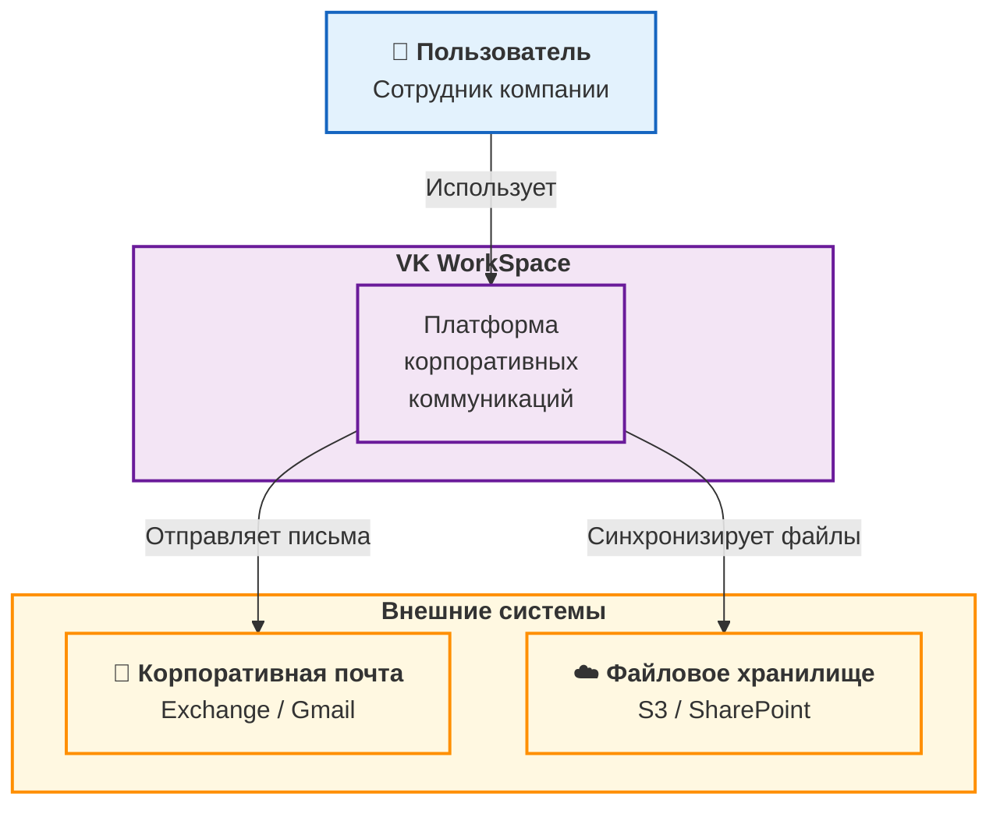

# Продвинутые возможности Markdown

## Сноски {#footnotes}

Техническая документация часто требует пояснений[^1]. Сноски можно добавлять в любом месте[^2].

[^1]: Это пример сноски. Она появляется внизу страницы.
[^2]: Сноски нумеруются автоматически.

---

## Предупреждения и заметки {#admonitions}

!!! note "Примечание"
    Это просто заметка. Дополнительная информация.

!!! warning "Внимание"
    Важная информация, требующая внимания.

!!! danger "Опасно!"
    Действие может привести к потере данных.

---

## Сворачиваемые блоки {#collapsible}

<details>
<summary>Нажмите, чтобы увидеть подробности</summary>

Здесь может быть:
- Любой текст
- Таблицы
- Код

```bash
docker run -d -p 80:80 nginx
```

</details>

---

## Список задач {#tasklist}

- [x] Изучить базовый Markdown
- [x] Создать репозиторий на GitHub
- [x] Настроить MkDocs
- [ ] Добавить продвинутые элементы
- [ ] Опубликовать на GitHub Pages

---

## Сложная таблица {#table}

| Параметр | Тип | Обязательный | Описание | Пример |
|----------|------|--------------|----------|--------|
| `name` | string | ✅ | Имя пользователя | `"Anna"` |
| `age` | integer | ❌ | Возраст | `25` |
| `roles` | array | ❌ | Список ролей | `["admin", "user"]` |

---

## Код с пояснениями {#code}

```python
def process_data(data):
    """Обработка данных"""
    if not data:  # Проверка на пустые данные
        return []
    
    result = [item for item in data if item.is_valid()]
    return result
```

---

## Ссылки на заголовки {#links}

Перейти к [разделу о сносках](#footnotes) или к [таблице](#table).

---

## Изображение {#image}

Вот пример того, как вставлять изображения в документацию:

{ width="400" }

*Рисунок 1 — Пример оформления документации (ширина 400px)*

---

## Диаграмма архитектуры {#architecture}

Ниже показана примерная архитектура взаимодействия компонентов в корпоративном сервисе (на основе VK WorkSpace):



---

## Flowchart (блок-схема процесса) {#flowchart}

Ниже показан процесс авторизации пользователя в системе:



---

## Sequence diagram (диаграмма последовательности) {#sequence}

Диаграмма показывает порядок взаимодействия при отправке сообщения в мессенджере:



---

## C4 Context (системный контекст):

Контекстная диаграмма показывает, как пользователи взаимодействуют с системой VK WorkSpace и какие внешние системы задействованы.

